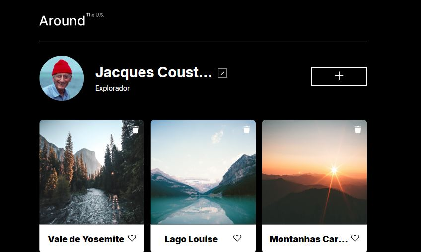
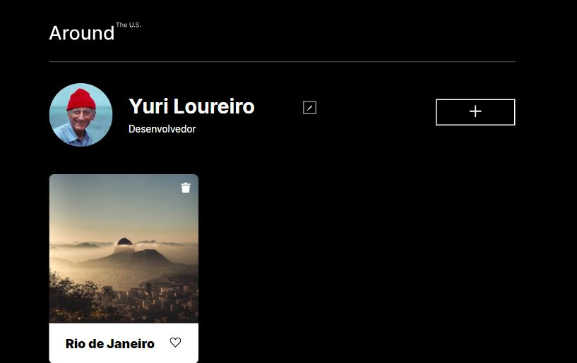
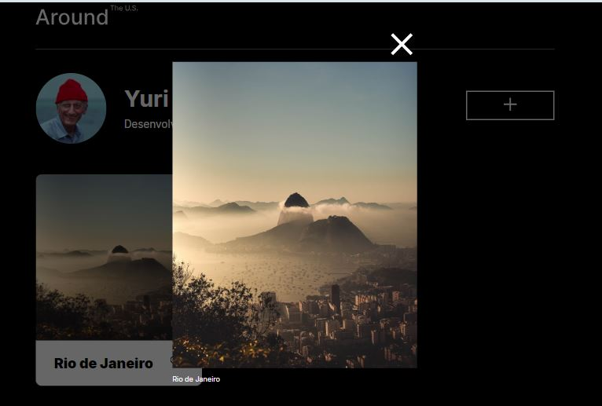

# Tripleten web_project_around

GitHub Pages: https://loureirz.github.io/web_project_around/

Nome: Around The U.S

O projeto é uma página web, como um instagram, onde podemos adicionar e excluir fotos de viagens.

Funcionalidades interessantes do projeto atual:

- Caixa Pop-Up para editar perfil (nome e trabalho),
- Caixa Pop-Up para adicionar outros cards (nome do lugar e link da imagem),
- Clicando em qualquer imagem ela abre no centro da tela,
- Funcionalidades como: curtir fotos e excluir,
- Site totalmente responsivo.

Outras que irei adicionar futuramente:

- Validação de formulário.

Tecnologias usadas:

- HTML,
- CSS, e
- JavaScript.

Feito por Yuri Loureiro.

Página Original:

Editada:

Zoom Imagem:

